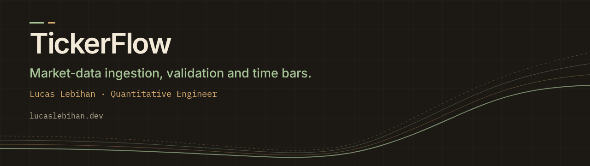

# TickerFlow



[](https://github.com/HtFilia/tickerflow/actions/workflows/ci.yml)

TickerFlow is a Python backend that turns local market CSVs into validated, queryable API data.

## Start reviewing here

Problem: make local OHLCV data quality decisions visible before data is queryable.

- Workflow: CSV → canonical UTC frame → validation report → partitioned Parquet
  → half-open queries → hourly/daily time bars → FastAPI demo.
- Hard decision: quarantine invalid rows without silent repair.
  [Quality policy and the invalid-OHLC regression](docs/QUALITY_AND_VALIDATION.md).
- Validation: [dirty fixture report tests](tests/unit/test_ohlcv_ingestion_validation.py)
  and [ingestion/storage/query regressions](tests/integration/test_ohlcv_storage_query.py).
- Quick run: `uv sync --extra dev && uv run pytest`; then follow the complete
  [seed → query demonstration](docs/DEMO.md).
- Limits: local filesystem and one writer; identical-key repeat ingestion is
  idempotent, but does not establish concurrent-write safety. Writes directly replace
  partitions; no atomic crash recovery or multi-partition transactions are promised.
  Trades/quotes and tick/volume/dollar bars remain planned.

## Use case

Market-data pipelines need deterministic ingestion, explicit schemas, visible
quality decisions, durable storage, and stable query boundaries. TickerFlow
provides that local workflow for financial time series, from CSV normalization
through Parquet storage and feature-ready time bars.

## Implemented capabilities

- Ingest local OHLCV CSV files with explicit schemas and configuration.
- Normalize timestamps to UTC and report data-quality issues.
- Store valid OHLCV rows as partitioned Parquet.
- Query datasets by symbol and half-open date range through Python and FastAPI.
- Build hourly and daily time bars with explicit interval boundaries.
- Explore the local workflow through the `/demo` page.

## Planned extensions

- Trade and quote ingestion.
- Tick, volume, and dollar bars.
- Reproducible performance benchmarks on larger datasets.

## Technology

- Python 3.12+
- Polars for DataFrame transformations.
- DuckDB for local analytical queries.
- PyArrow/Parquet for storage.
- Pydantic and FastAPI for backend contracts.
- pytest, ruff, and mypy for quality.

## Repository philosophy

1. Schemas before pipelines.
2. Deterministic local fixtures before live data.
3. Validation reports before silent cleaning.
4. Small vertical slices over broad unsupported features.

## First milestones

1. Bootstrap Python package, CI, linting, typing, and tests.
2. Define canonical schemas for OHLCV and trades.
3. Implement local CSV ingestion with validation reports.
4. Store normalized data as partitioned Parquet.
5. Add query service and FastAPI endpoint.
6. Implement time bars (done); volume bars remain planned.
7. Add benchmarks and quality-report examples.

## Current vertical slice

TickerFlow currently implements the first OHLCV backend slice:

- Load local OHLCV CSV files with typed ingestion configuration.
- Normalize timestamps to timezone-aware UTC at microsecond precision.
- Validate dirty rows and return a structured quality report instead of silently dropping data.
- Store valid rows as partitioned local Parquet under `ohlcv/symbol=<SYMBOL>/date=<YYYY-MM-DD>/data.parquet`.
- Query OHLCV rows by symbol and half-open UTC date range `[start, end)`.
- Discover available local datasets and symbols from Parquet partitions.
- Build hourly or daily time bars with explicit half-open boundaries.
- Expose `/health`, `/datasets`, `/symbols`, `/ohlcv`, and `/bars/time` through FastAPI.
- Provide a browser market-data demo at `/demo`.

### OHLCV schema assumptions

Input CSV fixtures use these columns:

```text
timestamp,symbol,open,high,low,close,volume
```

Canonical rows use:

```text
timestamp_utc: datetime[us, UTC]
symbol: uppercase string
open: float
high: float
low: float
close: float
volume: float
source: string
```

Prices are unadjusted fixture values in arbitrary currency units. OHLC prices must be finite, positive, and consistent with low/high bounds. Volume is a finite non-negative numeric quantity. Corporate actions and live data sources are intentionally out of scope.

### Local development

```bash
uv sync --extra dev
uv run ruff format .
uv run ruff check .
uv run mypy src tests
uv run pytest
```

Run the API locally:

```bash
uv run uvicorn tickerflow.api.main:app --reload
```

Open the market-data demo UI:

```bash
open http://127.0.0.1:8000/demo
```

Example query after writing Parquet data into the configured data directory:

```bash
curl "http://127.0.0.1:8000/ohlcv?symbol=AAPL&start=2024-01-02T00:00:00Z&end=2024-01-04T00:00:00Z"
```

Catalog endpoints:

```bash
curl "http://127.0.0.1:8000/datasets"
curl "http://127.0.0.1:8000/symbols?dataset=ohlcv"
```

Time-bar endpoint:

```bash
curl "http://127.0.0.1:8000/bars/time?symbol=AAPL&start=2024-01-02T14:00:00Z&end=2024-01-02T16:00:00Z&interval=1h"
```

By default, the API reads from `.tickerflow`. Set `TICKERFLOW_DATA_DIR` to point at another local Parquet root.

The deterministic demo script lives in `docs/DEMO.md`.

## Native homelab deployment

The prepared homelab manifest uses `sudo homelab project deploy tickerflow`,
running the repository quality gate before activating an immutable release.
Uvicorn is a runtime dependency, retained by production-only
`uv sync --frozen --no-extra dev --no-editable`. The API binds loopback behind
Caddy; `/health` checks readiness and the existing root redirects to `/demo`.
Set `TICKERFLOW_DATA_DIR` to writable state outside the release (the VPS
manifest uses `/var/lib/homelab/tickerflow/data`). Demo input remains synthetic.
Public DNS and privileged host setup require separate publication; this README
does not claim that the prepared VPS demo is already live.
